<a name="readme-top"></a>

<!-- PROJECT SHIELDS -->
[](https://www.linkedin.com/in/nirmit-khurana-3852841a6/)

<!-- PROJECT LOGO -->
<br />
<div align="center">
  <h1 align="center">🏦 NorthRisk 2026</h1>
  <h3 align="center">Mortgage Renewal Stress Tester</h3>

  <p align="center">
    A Financial Risk Data Pipeline simulating Canada's 2026 Mortgage Renewal Cliff
    <br />
    <a href="#about-the-project"><strong>Explore the docs »</strong></a>
    <br />
    <br />
    <a href="#usage">View Demo</a>
    ·
    <a href="https://github.com/NirmitKhurana10/Canadian-Mortgage-Risk-Pipeline/pulls">Request Feature</a>
  </p>
</div>

<!-- TABLE OF CONTENTS -->
<details>
  <summary>Table of Contents</summary>
  <ol>
    <li>
      <a href="#about-the-project">About The Project</a>
      <ul>
        <li><a href="#the-business-problem">The Business Problem</a></li>
        <li><a href="#built-with">Built With</a></li>
      </ul>
    </li>
    <li>
      <a href="#technical-solution">Technical Solution</a>
      <ul>
        <li><a href="#medallion-architecture">Medallion Architecture</a></li>
        <li><a href="#key-sql-concepts">Key SQL Concepts</a></li>
      </ul>
    </li>
    <li><a href="#getting-started">Getting Started</a></li>
    <li><a href="#usage">Usage</a></li>
    <li><a href="#roadmap">Roadmap</a></li>
    <li><a href="#contributing">Contributing</a></li>
    <li><a href="#license">License</a></li>
    <li><a href="#contact">Contact</a></li>
    <li><a href="#acknowledgments">Acknowledgments</a></li>
  </ol>
</details>

<!-- ABOUT THE PROJECT -->
## About The Project

**NorthRisk 2026** is a sophisticated Financial Risk Data Pipeline built on Databricks using the Medallion Architecture. This project simulates the 2026 Canadian "Mortgage Renewal Cliff," transforming raw loan performance data to predict **Payment Shock** for borrowers facing significant interest rate hikes.

### Executive Summary

This project demonstrates advanced data engineering and financial risk modeling by:
- 📊 Ingesting and processing US Fannie Mae loan performance data
- 🔄 Transforming 30-year fixed loans into Canadian 5-year renewable terms
- 📈 Simulating 2026 interest rate scenarios to quantify borrower risk
- 🎯 Identifying high-risk accounts vulnerable to payment shock

<p align="right">(<a href="#readme-top">back to top</a>)</p>

### The Business Problem

#### Context
Canadian mortgages typically renew every 5 years. Borrowers who originated loans in 2020-2021 at historical lows (~1.5%) are facing renewals in 2025-2026 at significantly higher market rates (~4.5%+).

#### The Risk
Banks face a **"Renewal Cliff"** where monthly payments could increase by 30-50%, leading to:
- 💥 Spike in defaults (Delinquency Risk)
- 📉 Increased loan loss provisions
- 🏚️ Potential housing market instability

#### The Goal
Build a data pipeline to:
1. Identify exactly which customers are renewing in 2026
2. Quantify their financial **Payment Shock** (Rate Spread)
3. Enable proactive risk management and customer intervention

<p align="right">(<a href="#readme-top">back to top</a>)</p>

### Built With

This project leverages cutting-edge data engineering technologies:

* ![Databricks][Databricks-badge]
* ![Delta Lake][DeltaLake-badge]
* ![SQL][SQL-badge]
* ![Python][Python-badge]

<p align="right">(<a href="#readme-top">back to top</a>)</p>

<!-- TECHNICAL SOLUTION -->
## Technical Solution

This project implements the **Lakehouse Architecture** using Delta Lake on Databricks, processing data through three quality layers:

### Medallion Architecture

```mermaid
graph LR
    A[Raw CSV Data] -->|Ingest| B[🥉 Bronze Layer]
    B -->|Transform| C[🥈 Silver Layer]
    C -->|Aggregate| D[🥇 Gold Layer]
    E[Market Data] -->|Enrich| D
    D -->|Analytics| F[Risk Dashboard]
    
    style B fill:#cd7f32,stroke:#8b4513,stroke-width:3px,color:#fff
    style C fill:#c0c0c0,stroke:#808080,stroke-width:3px,color:#000
    style D fill:#ffd700,stroke:#b8860b,stroke-width:3px,color:#000
```



#### 🥉 Bronze Layer (Raw Ingestion)
**Purpose:** Capture raw data exactly as-is for auditing and reprocessing

- Ingested semi-structured CSV data (pipe-delimited)
- Source: Fannie Mae Single-Family Loan Performance Dataset
- Implemented **"Schema on Read"** to handle schema evolution
- Prevents load failures from data quality issues

**Key Operations:**
```sql
-- Example: Raw data ingestion with schema inference
load data local infile '/Users/nirmitkhurana/Desktop/Nirmit Docs/Projects/SQL/Data-warehouse-project/dataset/mortgage_data_sample.csv'
into table fannie_mae_bronze.loan_performance_2021_q2
fields terminated by '|'
lines terminated by '\n'
ignore 1 lines;

```

#### 🥈 Silver Layer (Transformation & Enrichment)
**Purpose:** Clean, normalize, and enrich data for business consumption

**Normalization:**
- Split flat files into **Star Schema**
- `Loan_Details` (Dimension Table)
- `Loan_Performance` (Fact Table)
- Optimized query performance

**Business Logic:**
- Applied **Canadian Transformation Logic**
- Converted 30-year amortization → 5-year renewable terms
- Formula: `Renewal_Date = Origination_Date + 60 months`

**Data Quality:**
- Cast strict data types (Dates, Doubles, Integers)
- Filtered for active loans only
- Removed duplicate records

**Key Operations:**
```sql
-- Example: Calculate renewal dates for Canadian mortgage model
SELECT 
    loan_id,
    origination_date,
    ADD_MONTHS(origination_date, 60) as first_renewal_date,
    current_interest_rate,
    original_loan_amount,
    current_balance
FROM silver_loan_details
WHERE loan_status = 'ACTIVE'
```

#### 🥇 Gold Layer (Business Aggregation)
**Purpose:** Create business-ready analytics and risk models

**Market Simulation:**
- Created dimension table for **2026 Interest Rate Scenarios**
- Simulates Bank of Canada Bond Yields
- Multiple scenario modeling (Conservative, Base, Aggressive)

**Risk Modeling:**
- Joined internal loan data with external market data
- Calculated **Rate Increase Spread** for each borrower
- Identified high-risk cohorts (Payment Shock > 2%)

**Key Metrics:**
```sql
-- Example: Calculate payment shock for 2026 renewals
SELECT 
    ld.loan_id,
    ld.borrower_credit_score,
    ld.current_interest_rate,
    mrs.projected_2026_rate,
    (mrs.projected_2026_rate - ld.current_interest_rate) as rate_spread,
    ld.current_monthly_payment,
    -- Simplified payment calculation
    (ld.current_balance * mrs.projected_2026_rate / 12) as projected_monthly_payment
FROM gold_loan_details ld
JOIN market_rate_scenarios mrs 
    ON YEAR(ld.first_renewal_date) = mrs.scenario_year
WHERE ld.first_renewal_date BETWEEN '2026-01-01' AND '2026-12-31'
ORDER BY rate_spread DESC
```

<p align="right">(<a href="#readme-top">back to top</a>)</p>

### Key SQL Concepts

This project demonstrates advanced SQL and data engineering skills:

| Concept | Implementation | Business Value |
|---------|----------------|----------------|
| **Complex ETL** | Handling custom delimiters (`\|`) and messy raw data | Data ingestion resilience |
| **Data Modeling** | Converting flat files into Star Schema (3NF) | Query optimization & maintainability |
| **Date Manipulation** | `add_months()`, `to_date()`, date-based joins | Simulate future financial events |
| **Analytical Windowing** | Credit score analysis vs. market volatility | Risk segmentation |
| **ACID Transactions** | Delta Lake time travel & versioning | Data reliability & auditability |

<p align="right">(<a href="#readme-top">back to top</a>)</p>

<!-- GETTING STARTED -->
## Getting Started

Follow these steps to set up the project locally.

### Prerequisites

1. **Databricks Account** (Community Edition works)
   * [Sign up for Databricks Community Edition](https://community.cloud.databricks.com/login.html)

2. **Data Source**
   * Download Fannie Mae Single-Family Loan Performance data
   * [Fannie Mae Data Download](https://capitalmarkets.fanniemae.com/credit-risk-transfer/single-family-credit-risk-transfer/fannie-mae-single-family-loan-performance-data)
   
### Installation (work in progress)

1. **Clone the repository**
   ```sh
   git clone https://github.com/nirmitkhurana/DatabricksProject.git
   ```

2. **Upload to Databricks**
   - Navigate to your Databricks workspace
   - Import the notebook files from `/notebooks`
   - Upload raw data files to DBFS (Databricks File System)


3. **Configure Data Paths**
   - Update notebook variables to point to your DBFS data location
   ```python
   # Example configuration
   raw_data_path = "/FileStore/tables/raw_loan_data/"
   bronze_path = "/FileStore/tables/bronze/"
   silver_path = "/FileStore/tables/silver/"
   gold_path = "/FileStore/tables/gold/"
   ```

4. **Run Notebooks in Order**
   - `01_bronze_ingestion.sql`
   - `02_silver_transformation.sql`
   - `03_gold_analytics.sql`

<p align="right">(<a href="#readme-top">back to top</a>)</p>

<!-- USAGE -->
## Usage

### Example: Identify High-Risk Renewals for 2026

```sql
-- Query to find borrowers with >2% rate increase
SELECT 
    loan_id,
    borrower_name,
    current_rate,
    projected_rate,
    rate_spread,
    current_monthly_payment,
    projected_monthly_payment,
    payment_increase_pct
FROM gold_risk_analysis
WHERE renewal_year = 2026
  AND rate_spread > 0.02  -- 2% increase threshold
  AND borrower_credit_score < 700  -- Higher default risk
ORDER BY payment_increase_pct DESC
LIMIT 100;
```

### Dashboard Analytics

The Gold layer enables business users to visualize:
- 📊 Distribution of renewal dates
- 💰 Total exposure by rate scenario
- 🎯 High-risk customer segments
- 📈 Historical vs. projected payment trends

### Sample Output

| Loan ID | Credit Score | Current Rate | Projected Rate | Rate Spread | Payment Shock |
|---------|--------------|--------------|----------------|-------------|---------------|
| LN-12345 | 680 | 1.5% | 4.75% | **3.25%** | **+45%** |
| LN-67890 | 720 | 1.8% | 4.50% | **2.70%** | **+38%** |

<p align="right">(<a href="#readme-top">back to top</a>)</p>

<!-- ROADMAP -->
## Roadmap and Proposed Features

- [x] Implement Bronze layer (raw ingestion)
- [x] Implement Silver layer (transformation)
- [x] Implement Gold layer (analytics)
- [x] Canadian mortgage conversion logic
- [ ] Add real-time streaming ingestion
- [ ] Implement ML model for default prediction
- [ ] Create interactive Tableau/Power BI dashboard
- [ ] Add data quality monitoring alerts
- [ ] Expand to multi-country mortgage models


<p align="right">(<a href="#readme-top">back to top</a>)</p>

<!-- CONTRIBUTING -->
## Contributing

Contributions make the open source community an amazing place to learn and create. Any contributions are **greatly appreciated**!

If you have suggestions to improve this project:

1. Fork the Project
2. Create your Feature Branch (`git checkout -b feature/AmazingFeature`)
3. Commit your Changes (`git commit -m 'Add some AmazingFeature'`)
4. Push to the Branch (`git push origin feature/AmazingFeature`)
5. Open a Pull Request

<p align="right">(<a href="#readme-top">back to top</a>)</p>

<!-- LICENSE -->
## License

Distributed under the MIT License. See `LICENSE.txt` for more information.

<p align="right">(<a href="#readme-top">back to top</a>)</p>

<!-- CONTACT -->
## Contact

**Nirmit Khurana** - khurananirmit5@gmail.com

[](https://www.linkedin.com/in/nirmitkhurana)
[](https://github.com/nirmitkhurana)


<p align="right">(<a href="#readme-top">back to top</a>)</p>

<!-- ACKNOWLEDGMENTS -->
## Acknowledgments

Resources and inspiration for this project:

* [Databricks Medallion Architecture Guide](https://www.databricks.com/glossary/medallion-architecture)
* [Fannie Mae Loan Performance Data](https://capitalmarkets.fanniemae.com/credit-risk-transfer/single-family-credit-risk-transfer/fannie-mae-single-family-loan-performance-data)
* [Delta Lake Documentation](https://docs.delta.io/)
* [Apache Spark SQL Guide](https://spark.apache.org/sql/)
* [Canadian Mortgage Market Analysis](https://www.bankofcanada.ca/)
* [Best Practices for Data Lake Architecture](https://docs.databricks.com/lakehouse/index.html)

<p align="right">(<a href="#readme-top">back to top</a>)</p>

---


<!-- MARKDOWN LINKS & IMAGES -->
[linkedin-shield]: https://img.shields.io/badge/-LinkedIn-black.svg?style=for-the-badge&logo=linkedin&colorB=0077B5
[linkedin-url]: https://linkedin.com/in/nirmitkhurana
[Databricks-badge]: https://img.shields.io/badge/Databricks-FF3621?style=for-the-badge&logo=databricks&logoColor=white
[Spark-badge]: https://img.shields.io/badge/Apache_Spark-E25A1C?style=for-the-badge&logo=apachespark&logoColor=white
[DeltaLake-badge]: https://img.shields.io/badge/Delta_Lake-00ADD8?style=for-the-badge&logo=delta&logoColor=white
[SQL-badge]: https://img.shields.io/badge/SQL-4479A1?style=for-the-badge&logo=postgresql&logoColor=white
[Python-badge]: https://img.shields.io/badge/Python-3776AB?style=for-the-badge&logo=python&logoColor=white
